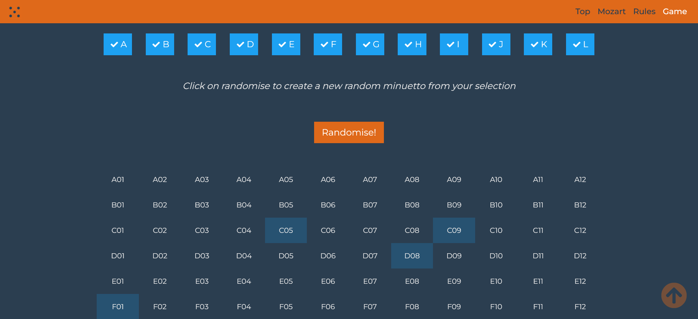

 
# Alea Iacta Est (Il Gioco dei Dadi Musicali)

Anche se il sito deve ancora iniziare le sue pubblicazioni, ho "forkato" (lo so, è un neologismo terribile...) tra i nostri _repository_, il bellissimo lavoro di [Guillermo Brachetta](https://github.com/GBrachetta) che implementa in forma interattiva il famoso [gioco dei dadi musicali](https://en.wikipedia.org/wiki/Musikalisches_W%C3%BCrfelspiel) attribuito a Mozart.
 <!-- more -->
 ---

 Spero di trovare il tempo, più avanti, di cambiare/approfondire, alcune parti della documentazione, ma intanto potete già iniziare a comporre i vostri minuetti generativo-aleatori col sistema che abbiamo messo _online_.

- [https://github.com/ABA-Sironi-Codex/Musical-Dice](https://aba-sironi-codex.github.io/Musical-Dice/).

<figure markdown>
  { width="300" }
  <figcaption>Interfaccia web del <a href="https://aba-sironi-codex.github.io/Musical-Dice/" target="_blank">Gioco dei Dadi Musicali</a></figcaption>
</figure>

La composizione aleatoria è una parte fondamentale dell'Arte Generativa e la rete è piena di ottima documentazione in merito, ma a chi fosse incappato in queste poche righe senza nessuna conoscenza in merito, mi sento di consigliare queste facili letture introduttive:

- [Overview of Generative Processes in the work of Brian Eno](https://drive.google.com/file/d/1_zkaxPgX3kkT8Cw6oiByC-eaLgfKuxsl/view?usp=sharing) | Un breve, ma interessante articolo, firmato da Rita Gradim, Pedro Duarte Pestana sulle influenze e le metodologie del padre della _Generative Music_.
- [Opera aperta, alea e indeterminazione](https://marcolenzi.wordpress.com/2017/01/01/opera-aperta-alea-e-indeterminazione/) | Il testo che Marco Lenzi scrisse nel 2005 per _Encyclomedia_, l’enciclopedia multimediale ideata e diretta da Umberto Eco.
- [(Caso) per caso. La contingenza nell’improvvisazione artistica](https://www.academia.edu/49200760/_Caso_per_caso_La_contingenza_nell_improvvisazione_artistica) | Uno scritto del prof. Alessandro Bertinetto, ordinario di Estetica presso l'Università degli Studi di Torino, Dipartimento di Filosofia e Scienze dell'Educazione.
- [La rilettura del Barbiere](https://www.albertozedda.com/la-rilettura-del-barbiere) | L'indimenticabile Direttore Alberto Zedda aiuta a comprendere come anche la partitura rossiniana de _Il barbiere di Siviglia_ potesse essere intesa, in un certo senso, come "aleatoria".  

---

Commenti e contributi possono essere inviati attraverso l'[area dedicata](https://github.com/orgs/ABA-Sironi-Codex/discussions).