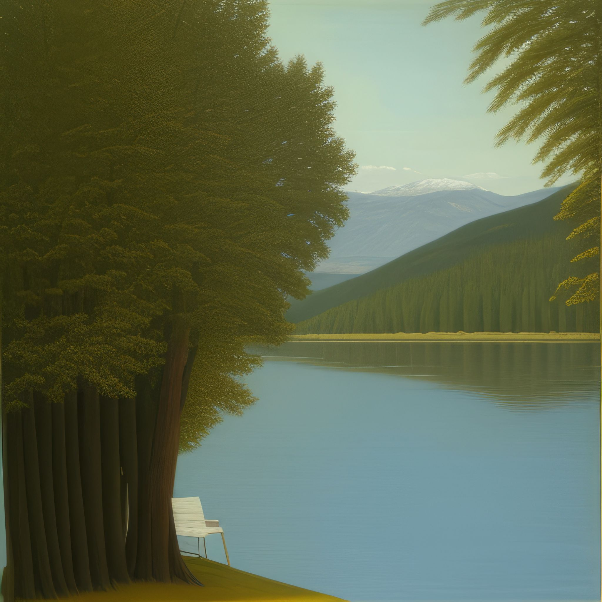

Llava (_Large Language and Vision Assistant_) è un modello multimodale, addestrato da un gruppo di ricercatori Microsoft, in grado di sostenere dialoghi con esseri umani e riconoscere immagini, basato su [Vicuna](https://lmsys.org/blog/2023-03-30-vicuna/) un modello linguistico _Open Source_ già in grado di offrire il 90% della "qualità" di ChatGPT.
 <!-- more -->
---

[Microsoft](https://www.microsoft.com/en-us/research/project/llava-large-language-and-vision-assistant/overview/) ha rilasciato il progetto sotto licenza _Open Source_ e tutta la documentazione, i dati di addestramento e le istruzioni per l'installazione sono su [GitHub](https://github.com/haotian-liu/LLaVA). Le richieste _hardware_ per una installazione non quantizzata sono piuttosto elevate per gli utenti domestici, ma si può comunque testare una demo gratuita.

- [Llava Demo (apre una nuova finestra)](https://llava.hliu.cc/){:target="_blank"}

Ho fatto due test: nel primo ho chiesto a Llava di scrivere in italiano una breve descrizione di sé stesso e questa è la risposta che ho ottenuto.

- _Mi chiamo Vicuna e sono un modello di intelligenza artificiale addestrato per fornire assistenza e rispondere alle domande in modo efficiente e utile. Sono stato creato da un team di esperti di intelligenza artificiale che hanno lavorato duramente per sviluppare un modello che potesse fornire informazioni accurate e pertinenti su una vasta gamma di argomenti._

- _Il mio addestramento è stato basato su un'enorme quantità di dati provenienti da diverse fonti, tra cui libri, articoli online, siti web e database. Grazie a questa vasta gamma di fonti, sono in grado di fornire informazioni accurate e dettagliate su una vasta gamma di argomenti, dalle scienze alla storia, dalla cultura alla tecnologia._

- _Il mio obiettivo principale è quello di fornire assistenza e supporto alle persone che hanno domande o problemi. Sono stato progettato per essere accessibile e utile, in modo che le persone possano chiedere le informazioni di cui hanno bisogno senza dover cercare in modo approfondito. Inoltre, posso comunicare in diverse lingue, tra cui l'italiano, il francese e l'inglese, il che rende il mio servizio ancora più accessibile a un pubblico più ampio._

- _Oltre a fornire informazioni, sono anche in grado di eseguire una serie di compiti, tra cui la generazione di testo, la traduzione ed il riconoscimento immagini. Questi compiti possono essere utili per la creazione di contenuti online, la generazione di report e la creazione di presentazioni._

- _In sintesi, sono un modello di intelligenza artificiale sempre in evoluzione e in continua migliorazione, il cui obiettivo principale è quello di fornire un servizio utile e di qualità alle persone che lo utilizzano._

A parte l'uso di "migliorazione" al posto di miglioramento, il risultato è notevole. Nel secondo test ho chiesto (in inglesse) a Llava di darmi qualche informazione su questa immagine, che ho generato con una mia IA durante una conferenza che ho tenuto insieme al [prof. Baronciani](https://www.accademiavenezia.it/docenti/317) pochi giorni fa. Ho specificatamente chiesto di sapere se riteneva che fosse stata generata da un'altra IA e se vi riconosceva un particolare stile pittorico. Di seguito, le risposte.

<figure markdown>
  { width="500" }
  <figcaption><i>Il pescatore</i>, Davide Riboli (Stable Diffusion, 2023)</figcaption>
</figure>

- _The image features a serene scene of a lake surrounded by trees, with a bench situated near the water. The bench is positioned under a large tree, providing shade and a peaceful spot to sit and enjoy the view. The lake is calm and reflects the beauty of the surrounding landscape, which includes a mountain range in the distance. The overall atmosphere of the scene is tranquil and inviting, making it an ideal location for relaxation and contemplation._

- _It is possible that the image is by Alex Colville, as his artwork often features tranquil landscapes and scenes of nature. However, without more information or a clear signature, it is difficult to confirm the artist's identity with certainty._

- _It is not possible to definitively determine if the image was created by an AI or not, as AI-generated images can be quite realistic and difficult to distinguish from real photographs. However, without more context or information about the image's creation process, it is not possible to say for sure whether it was created by an AI or not._

Ho trovato interessante la presenza di una frase come: _an ideal location for relaxation and contemplation_ che mi pare testimoni che, oltre al riconoscimento dei soggetti primi (alberi, lago, sedia), Llava è già in grado di descrivere anche l'atmosfera che una determinata immagine evoca. 

---

