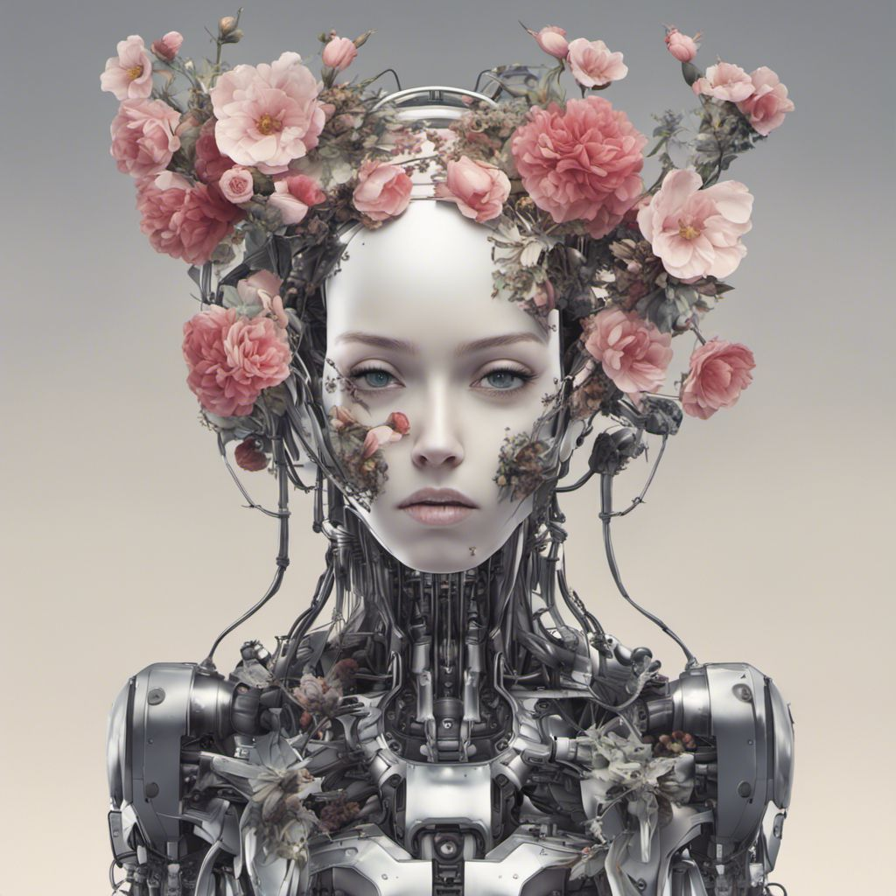

Un indice dei migliori siti gratuti per muovere i primi passi in [Stable Diffusion](https://stability.ai/stable-diffusion).
 <!-- more -->
---

- [DreamStudio](https://dreamstudio.ai/) | Web app di Stability (la forgia di SD). 100 crediti gratuiti in partenza che non si consumano troppo in fretta.
- [Civitai](https://civitai.com/) | Sembra un sito per adoloescenti in preda a tempeste ormonali, ma in realtà è il secondo punto di riferimento in rete per i modelli genere SD, dopo Huggingface. Anche in questo caso, 100 crediti di partenza che non si consumano troppo in fretta.
- [Mage Space](https://www.mage.space/) | L'interfaccia più facile che esista: scrivi quel che desideri ottenere, clic, fatto.
- [Playground AI](https://playgroundai.com/) | 500 creazioni al giorno, gratuite.
- [DezGo](https://dezgo.com/txt2img) | Semplice e, tutto sommato, abbastanza veloce.
- [Neural Love](https://neural.love/ai-art-generator) | Generatore gratuito (richiede iscrizione). Disponibile solo la versione 1.5 di SD e parametri abbastanza limitati.
- [Stable Horde]() | Piuttosto lento perché basato su _crowd sourced computing_, ma non richiede iscrizione e offre una buona serie di parametri.
- [Craiyon](https://www.craiyon.com/) | Poco più che un app da cellulare, ma piuttosto veloce.
- [AI Art Generator](https://hotpot.ai/art-generator) | Implementa un modello proprio che sembra piuttosto vicino a SD 1.4/1.5. Buono, considerando che è gratuito, e ragionevolmente rapido.

Qui sotto, tre esempi ottenuti con lo stesso _prompt_ su quelli che mi sembrano i tre migliori servizi considerando prezzo/velocità/parametri. In tutti e tre i casi ho solo fornito il _prompt_, senza cambiare alcun parametro dal _default_ proposto.

Il _prompt_ è:

```
anime female mechanical android head with flowers growing out

Modello: stable-diffusion sdxl (o altro, su disponibilità di default)
Guidance Scale: 7.5
Steps: 20
Scheduler: euler o euler-a
```

|                   |                   |                   |
| :---------------: | :---------------: | :---------------: |
| <figure markdown>{ width="300" }<figcaption>DreamStudio</figcaption></figure> | <figure markdown>{ width="300" }<figcaption>Mage Space</figcaption></figure> | <figure markdown>{ width="300" }<figcaption>Dezgo</figcaption></figure> |

---

