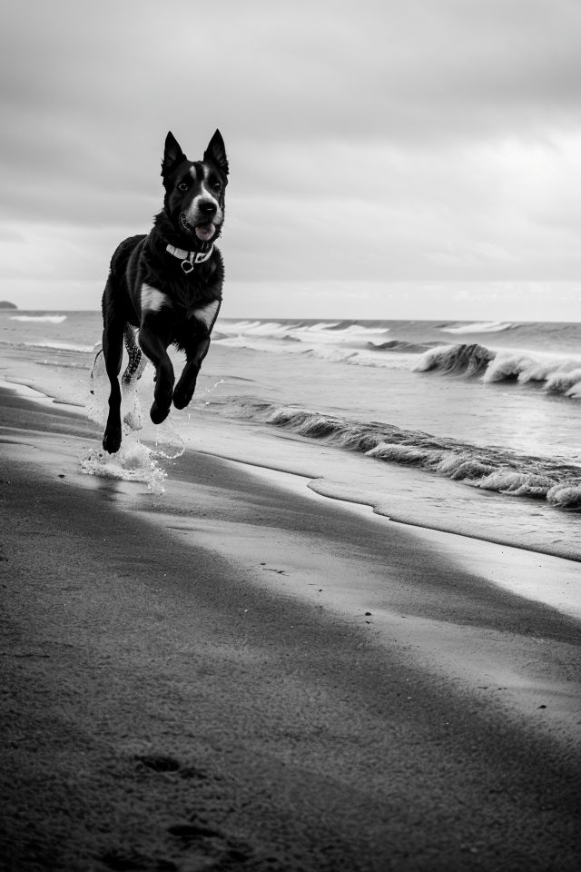

Sul nostro wiki dedicato a Stable Diffusion è disponibile una guida completa alla creazione di immagini fotorealistiche in ComfyUI.
 <!-- more -->

Il flusso di lavoro illustrati può essere preso a modello da chiunque sia alle prime armi con la creazione di immagini attraverso IA Generative Open Source. Questo il link diretto alla guida:

- [Immagini fotorealistiche con Comfy UI, RealisticVision e BadDream, UnrealisticDream, FastNegative Embedding](https://github.com/ABA-Sironi-Codex/Stable-Diffusion-Wiki/wiki/Immagini-fotorealistiche-con-Comfy-UI,-RealisticVision-e-BadDream,-UnrealisticDream,-FastNegative-Embedding)

Questi sono alcuni esempi dei risultati ottenibili.

|                   |                   |                   |
| :---------------: | :---------------: | :---------------: |
| <figure markdown>{ width="300" }</figure> | <figure markdown>{ width="300" }</figure> | <figure markdown>{ width="300" } </figure> |
| <figure markdown>{ width="300" }</figure> | <figure markdown>{ width="300" }</figure> | <figure markdown>{ width="300" } </figure> |
|   | <figure markdown>{ width="300" }</figure> |   |

---
