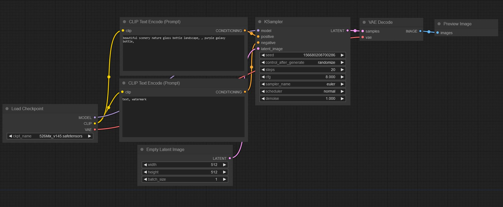
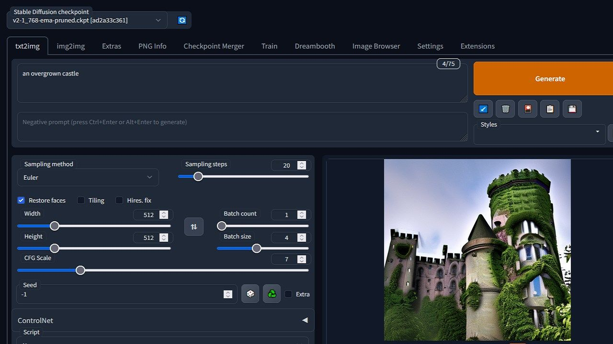
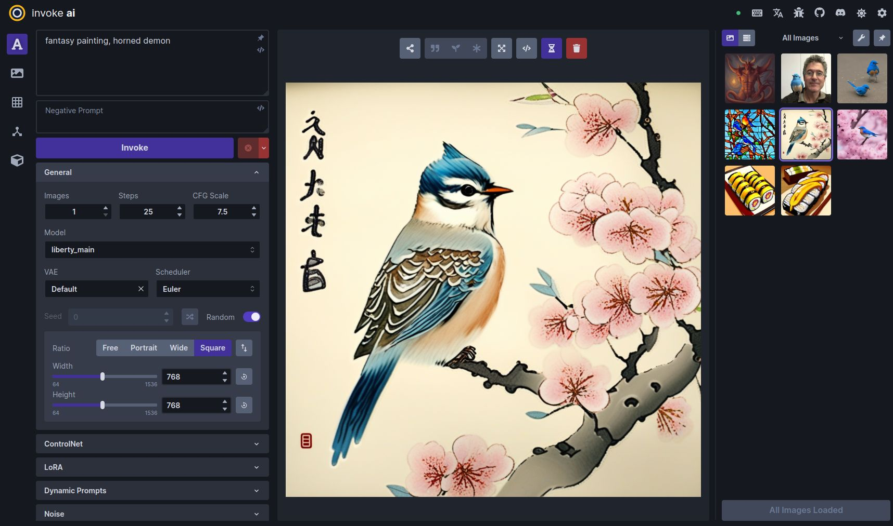

Le interfacce di comando per "pilotare" [Stable Diffusion](https://stability.ai/stable-diffusion), da installare sul proprio computer o in cloud.
 <!-- more -->
---

Per controllare il processo generativo che vogliamo ottenere da Stable Diffusion (o da modelli simili) c'è bisogno di una interfaccia di controllo. Ce ne sono molte disponibili, quasi tutte _Open Source_ e gratuite. Queste sono quelle che preferisco. Vengono rese tutte e tre disponibili attraverso GitHub e i rispettivi _repository_ sono una vera miniera di informazioni. RTFM o non ne caverete le gambe.

- [Comfy UI](https://github.com/comfyanonymous/ComfyUI) | È il mio sistema preferito, anche se può soltanto generare immagini. La sua interfaccia a nodi aiuta a comprendere a fondo come funziona il processo generativo e offre una libertà d'azione davvero unica. Non credo sia un caso che sia quella preferita anche da un grande artista come von Wolfe.
- [Automatic1111 SD WebUI](https://github.com/AUTOMATIC1111/stable-diffusion-webui) | La più famosa in assoluto, al punto da essere quasi considerata come parte imprescindibile di SD. Ci sono godzillioni di tutorial su tutte le sue funzioni che permettono di fare molte più cose oltre alla "semplice" generazione di immagini, come video, musica, riconoscimento inverso, addestramento di modelli, etc. Lo standard, de facto.
- [Invoke AI](https://github.com/invoke-ai/InvokeAI) | Molto simile ad Automatic1111, leggermente più limitata, ma molto più ordinata.

|                   |                   |                   |
| :---------------: | :---------------: | :---------------: |
| <figure markdown>{ width="300" }<figcaption>Comfy UI</figcaption></figure> | <figure markdown>{ width="300" }<figcaption>Automatic1111</figcaption></figure> | <figure markdown>{ width="300" }<figcaption>Invoke AI</figcaption></figure> |

---
