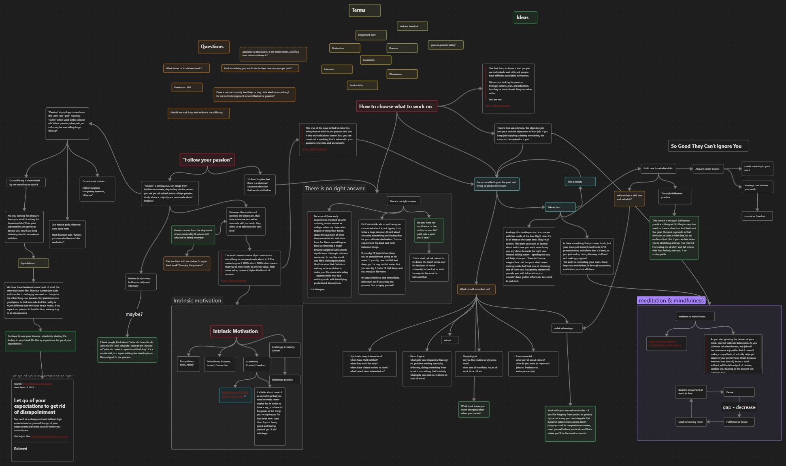

Nuovo _repository_ sull'Area GitHub ABA Sironi.
 <!-- more -->

<figure markdown>{ width="500" }</figure>

[Obsidian](https://obsidian.md) è ormai uno standard nel mondo della ricerca e dell'insegnamento per quanto concerne la creazione di archivi e basi di conoscenza.

Il nuovo *repository* disponibile nella nostra Area GitHub all'URL [https://github.com/ABA-Sironi-Codex/Obsidian-4-Academics](https://github.com/ABA-Sironi-Codex/Obsidian-4-Academics) fornisce risorse per l'uso del _software_ in ambito accademico, con particolare riferimento ai sistemi di esportazione via [Pandoc](https://pandoc.org/) e [LaTeX](https://www.latex-project.org/) e alla integrazione con [Zotero](https://www.zotero.org/).

I materiali sono organizzati in forma di *vault*: scaricate e installate Obsidian prima di scaricare o clonare il *repository*.

Il codice di tutti gli *script* contenuti e prodotti da terze parti come *plugin* aggiuntivi, temi ed altre risorse viene controllato ad ogni nuovo *push* ed è da considerarsi affidabile. Ricordatevi però di controllarne l'aggiornamento.

Le impostazioni di *default* cercano di impostare i *font* d'interfaccia e codice alle famiglie "Source Sans" e "Source Code" che possono essere scaricate gratuitamente da [Google Fonts](https://fonts.google.com/?query=source).

Il *repository* (per il momento) non offre un'area discussioni: eventuali dubbi, domande e segnalazioni possono essere inoltrati attraverso questo _post_.

---
