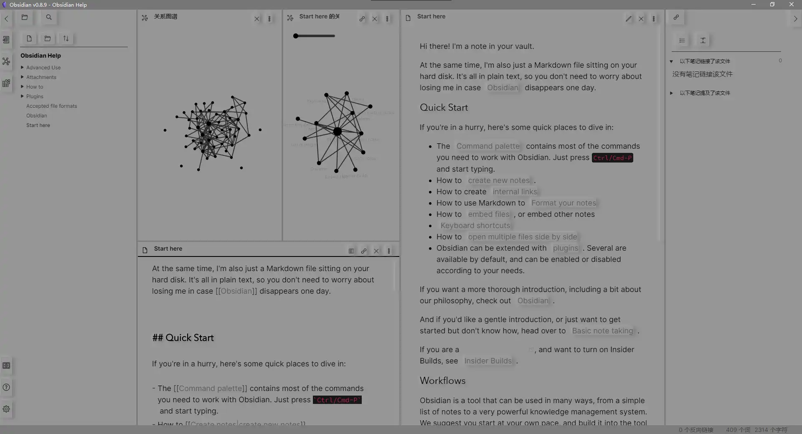

Sull'Area GitHub ABA Sironi è disponibile un nuovo _repository_ di strumenti dedicati alla scrittura accademica e scientifica.
 <!-- more -->

<figure markdown>{ width="500" }</figure>

[Obsidian](https://obsidian.md) è ormai uno standard nel mondo della ricerca e dell'insegnamento per quanto concerne la creazione di archivi e basi di conoscenza. La sua struttura modulare permette l'integrazione di altri eccellenti software come [Pandoc](https://pandoc.org/), [LaTeX](https://www.latex-project.org/) e [Zotero](https://www.zotero.org/) che possono trasformare Obsidian in un programma ottimo anche per la scrittura accademica e scientifica (tesi, saggi, dissertazioni, etc.).

Il nuovo *repository* disponibile nella nostra Area GitHub all'URL [https://github.com/ABA-Sironi-Codex/O4A](https://github.com/ABA-Sironi-Codex/O4A) fornisce guide e risorse per questo genere d'impiego.

I materiali sono organizzati in forma di *vault*: scaricate e installate Obsidian prima di scaricare o clonare il *repository*.

Il codice di tutti gli *script* contenuti e prodotti da terze parti come *plugin* aggiuntivi, temi ed altre risorse viene controllato ad ogni nuovo *push* ed è da considerarsi affidabile. Ricordatevi però di controllarne l'aggiornamento.

Le impostazioni di *default* cercano di impostare i *font* d'interfaccia e codice alle famiglie "Source Sans" e "Source Code" che possono essere scaricate gratuitamente da [Google Fonts](https://fonts.google.com/?query=source).

Domande, segnalazioni e contributi possono essere inoltrati attraverso l'[area discussioni dedicata](https://github.com/ABA-Sironi-Codex/O4A/discussions/categories/discussioni-e-contributi).

---
