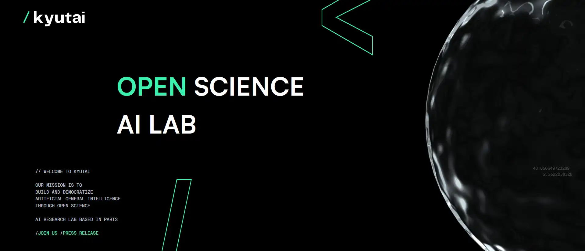

La risposta europea ad _OpenAI_ sta cercando ricercatori.
<!-- more -->

<figure markdown>{ width="500" }</figure>

KyutAI ([http://kyutai.org/](http://kyutai.org/)) è il nuovo progetto di Xavier Niel (il fondatore di Iliad) che ha personalmente investito nell'iniziativa circa 100 milioni di euro. Grazie ad altri sostenitori che credono nell'idea di costruire un modello di IA europeo in grado di competere con quelli americani e cinesi, KyutAI può contare su un capitale di partenza vicino ai 300 milioni di euro.

KyutAI nasce come azienda no profit e, al momento, dichiara di voler rilasciare i propri risultati sotto licenze _Open Source_.

È stata avviata la fase di reclutamento di scienziati, informaatici, matematici e artisti interessati a lavorare in KyutAI a tempo pieno o con altre formule. Il modulo di candidatura è disponibile qui:

- [https://docs.google.com/forms/d/e/1FAIpQLScDCxIWiBxM7eHnw3wcL6_9FrdWmw4oOhXFRx_IyrCgB3Alsg/viewform](https://docs.google.com/forms/d/e/1FAIpQLScDCxIWiBxM7eHnw3wcL6_9FrdWmw4oOhXFRx_IyrCgB3Alsg/viewform).

---
