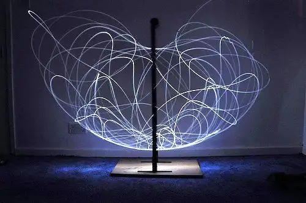

Sull'Area GitHub ABA Sironi è disponibile un nuovo _repository_ di risorse introduttive all'Arte Generativa.<!-- more -->

Nel 2023/24 il Conservatorio "Luigi Canepa" {[http://www.conservatorio.sassari.it](http://www.conservatorio.sassari.it/il-conservatorio/)} e l'Accademia di Belle Arti "Mario Sironi" {[http://accademiasironi.it](http://accademiasironi.it)}, entrambi di Sassari, hanno organizzato un ciclo di lezioni congiunte, per una selezione di studenti di entrambe le istituzioni, sull'Arte Generativa ed i principali strumenti compositivi di natura digitale ad essa correlati.

<figure markdown>{ width="500" }</figure>

L'iniziativa, curata e coordinata dal prof. Gian Luca Beccari (Cattedra di Progettazione Multimediale, ABA "Sironi") prevede un evento conclusivo in forma di installazione realizzata da tutti gli studenti (data e luogo ancora da decidersi).

Sull'Area GitHub ABA Sironi è disponibile un _repository_ con tutte le risorse di riferimento, messe a disposizione dai relatori invitati.

- Link diretto: [https://github.com/ABA-Sironi-Codex/Lezioni-di-Arte-Generativa](https://github.com/ABA-Sironi-Codex/Lezioni-di-Arte-Generativa)

---
