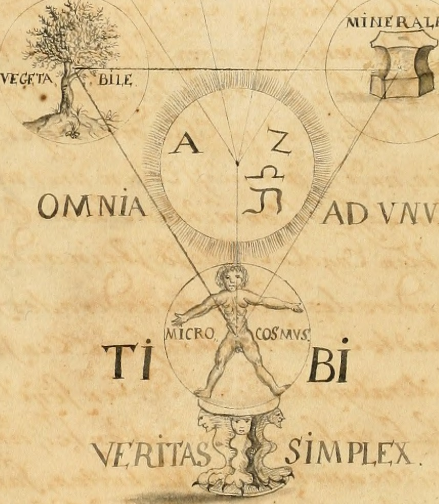

 
# Titolo

Breve paragrafo introduttivo o _abstract_ dell'articolo (3/5 righe al massimo).
 <!-- more -->
---

### Testo in Markdown

Le formattazioni e i link contenuti nel testo devono essere applicati in _Markdown_ e qualsiasi titolo interno deve essere di livello 2 o inferiore (livello 1, solo per titolo di pagina). Si veda:

- [The Markdown Guide](https://www.markdownguide.org/). 

### Righe vuote

I paragrafi debbono essere separati uno dall'altro da una riga vuota.

### Citazioni bibliografiche

Le citazioni[^1] vanno formattate seguendo lo stile MLA. La prima nota alla fine di questa pagina è un esempio di applicazione dello stile. Si vedano:

- [Purdue University, Online Writing Lab](https://owl.purdue.edu/owl/research_and_citation/mla_style/mla_formatting_and_style_guide/mla_general_format.html);
- [North Island College MLA Style Guide](https://library.nic.bc.ca/c.php?g=726538&p=5207740).

### Immagini

Le immagini devono essere in formato JPG o PNG e accompagnate da didascalia esplicativa. L'articolo non deve essere accompagnato da immagini di cui gli autori non possiedano i diritti di pubblicazione.

<figure markdown>
  { width="300" }
  <figcaption><i>Manly Palmer Hall  collection of alchemical manuscripts, 1500-1825</i> <a href="https://www.flickr.com/photos/internetarchivebookimages/14804148573/in/photostream/" target="_blank">Pubblico Dominio</a></figcaption>
</figure>

### Altri media

Se l'articolo deve contenere media di diversa natura, come (solo a titolo di esempio):

- elementi interattivi;
- suoni;
- video;

scrivere a [codex@accademiasironi.it](mailto:codex@accademiasironi.it) per concordare le soluzioni da adottare.

[^1]: Timmermann, Anke. “THE RIPLEY SCROLLS: ALCHEMICAL POETRY, IMAGES AND AUTHORITY.” _Verse and Transmutation: A Corpus of Middle English Alchemical Poetry (Critical Editions and Studies)_, Brill, 2013, pp. 113–42. JSTOR, [http://www.jstor.org/stable/10.1163/j.ctt1w76v4v.11](http://www.jstor.org/stable/10.1163/j.ctt1w76v4v.11). Consultato il 29 Sett. 2023.